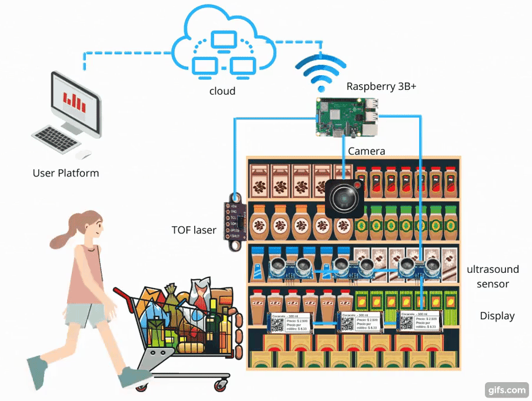
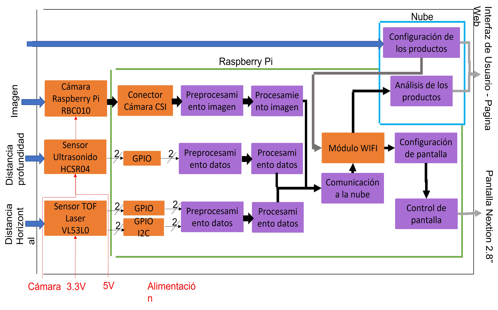

# Pagina Web
Smart shelf Pagina Web

## Construido con 🛠️
* [PHP] - El lenguaje de programación utilizado para la lógica de la página web.
* [HTML] - El lenguaje de programación utilizado para la estructura de la página web.
* [CSS] - El lenguaje de programación utilizado para el estilo de la página web.

## Autores ✒️
**Grupo I** 
**Juan Sebastian Barreto Jiménez** - *Equipo principal* - [jsebastianbarretoj99](https://github.com/jsebastianbarretoj99) 
**Carolina María Burgos Anillo** - *Equipo principal* - [cmba-alt ](https://github.com/cmba-alt) 
**Edwin Alejandro Caidedo Palacios** - *Equipo principal* - [Edwin99pal](https://github.com/Edwin99pal) 

## Proyecto: Smart shelf 
Smart Shelf es un sistema de control y monitoreo de estanterías en tiendas como supermercados y minimercados. Smart Shelf implementa etiquetas de precio electrónicas donde se encuentran el precio y un código QR para que los clientes consulten información de los productos. Se implementará un monitoreo de los estantes utilizando cámaras y sensores de distancia con tecnologías de ultrasonido y láser, con esta información notificará cuando sea necesario reaprovisionar los productos en una estantería específica o cuando un producto esté ubicado en el estante incorrecto. Por medio de un sitio web, la persona encargada de la tienda puede actualizar la información de las etiquetas de manera remota y podrá verificar si hacen falta productos, además de consultar información sobre todos los productos. Se puede consultar también tendencias de precios e información sobre los productos que se agotan con mayor frecuencia en las estanterías, teniendo en cuenta los días y las horas en las que los clientes los retiran.

### Arquitectura de alto nivel

### Diagrama de bloques
